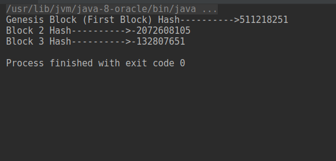
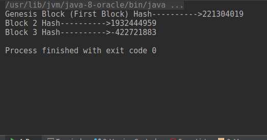

# simpleblockchaininjava
This project explains how to do simpleblockchain in java

### Source Code ###

Here I have created a simple Block class which has following fields.

    * previousHashCode
    * transcations
    * blockHashCode
    
blockHashCode has a hash value of previousHashCode and transcations.

**Used _Arrays.hashCode(<any>)_ to determine the Hash value.**

**Block.java**

```
public class Block {

    private int previousHashCode;
    private String[] transcations;

    private int blockHashCode;

    public Block(String[] transcations,int previousHashCode) {
        this.previousHashCode = previousHashCode;
        this.transcations = transcations;

        Object[] contens= {Arrays.hashCode(transcations), previousHashCode};
        this.blockHashCode = Arrays.hashCode(contens);

    }
    // Add Getters and Setters
```

**Main.java**

```
public class Main {

    public static void main(String[] args) {

        String[] genesisTranscations = {"Andrew sent 1000 euro to Peter through World Bank"};
        int genesisHashCode = 0;

        Block genesisBlock = new Block(genesisTranscations, genesisHashCode);

        String[] block2Transcations = {"Andrew sent 500 euro to Sam through Bank "};

        Block block2 = new Block(block2Transcations, genesisBlock.getBlockHashCode());

        String[] block3Transcations = {"Andrew sent 5000 euro to Sandy through Bank "};

        Block block3 = new Block(block3Transcations, block2.getBlockHashCode());

        System.out.println("Genesis Block (First Block) Hash---------->" + genesisBlock.getBlockHashCode());

        System.out.println("Block 2 Hash---------->" + block2.getBlockHashCode());

        System.out.println("Block 3 Hash---------->" + block3.getBlockHashCode());


    }
}

```
*** Genesis block is a first block which has no previous hash value. 

* Block1 has previous hash (Genesis block) with current transcations.

* Block2 has previous hash (Block1) with current transcations.**

**Output:**




Lets say, If we change value from any one of the transcations,you complete block will get change. it will give the different hash values which has wrong.

We conclude you data was hacked by someone which is insecure.

For example, if we change genesis block transcations like this 

I changed value from 1000 to 10000

```
String[] genesisTranscations = {"Andrew sent 10000 euro to Peter through World Bank"};

```

I have got output like this



You can see different hashvalues.

### Happy Coding ###